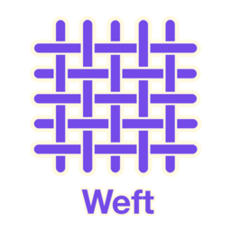

<p align="center">
  
</p>

> _noun_ the horizontal threads in weaving, creating the fabric's structure.

# weft 

A Go template engine for code generation with extensible post-processing, state management, debugging, and testing utilities.

## Packages

- **[config](config/)** - Generic YAML configuration loading with validation support
- **[engine](engine/)** - Core template processing with caching and concurrent rendering
- **[postprocess](postprocess/)** - Extensible post-processing framework for transforming generated content
- **[processors](processors/)** - Built-in post-processors (Go imports, whitespace cleanup, headers, etc.)
- **[render](render/)** - Template discovery, blocks, includes, and function registry  
- **[write](write/)** - File writing with coordination, locking, and composite operations
- **[state](state/)** - File tracking, manifest management, and cleanup operations
- **[debug](debug/)** - Debugging, error handling, and template validation
- **[testing](testing/)** - Testing utilities, benchmarks, mocks, and snapshots

## Basic Usage

```go
package main

import (
    "github.com/cpcf/weft/engine"
    "github.com/cpcf/weft/processors"
)

func main() {
    // Create template engine
    eng := engine.New(
        engine.WithOutputRoot("./generated"),
        engine.WithFailureMode(engine.FailFast),
    )

    // Add post-processors for generated content
    eng.AddPostProcessor(processors.NewGoImports())                // Fix Go imports & formatting
    eng.AddPostProcessor(processors.NewTrimWhitespace())           // Clean whitespace
    eng.AddPostProcessor(processors.NewAddGeneratedHeader("myapp", ".go")) // Add headers
    
    // Create context
    ctx := engine.NewContext(templateFS, "./generated", "mypackage")
    
    // Render templates with post-processing
    if err := eng.RenderDir(ctx, "templates", data); err != nil {
        log.Fatal(err)
    }
}
```

## Post-Processing System

weft includes an extensible post-processing framework that transforms generated content:

### Built-in Processors

- **Go Imports** - Automatically fixes imports and formats Go code using `goimports`
- **Trim Whitespace** - Removes trailing whitespace from all lines
- **Generated Headers** - Adds "Code generated" headers to files
- **Regex Replace** - Custom regex-based transformations

### Custom Processors

Create custom processors by implementing the `postprocess.Processor` interface:

```go
type MyProcessor struct{}

func (p *MyProcessor) ProcessContent(filePath string, content []byte) ([]byte, error) {
    if strings.HasSuffix(filePath, ".go") {
        // Custom Go transformations
        return transformGoCode(content), nil
    }
    return content, nil
}

// Add to engine
eng.AddPostProcessor(&MyProcessor{})
```

### Function-based Processors

For simple transformations, use function processors:

```go
eng.AddPostProcessorFunc(func(filePath string, content []byte) ([]byte, error) {
    // Convert line endings to Unix style
    return bytes.ReplaceAll(content, []byte("\r\n"), []byte("\n")), nil
})
```

See [postprocess/README.md](postprocess/README.md) for comprehensive documentation.

## Configuration Loading

The config package provides utilities for loading YAML configuration files into your custom types:

```go
import "github.com/cpcf/weft/config"

type MyConfig struct {
    Name    string            `yaml:"name"`
    Version string            `yaml:"version"`
    Options map[string]string `yaml:"options"`
}

func main() {
    var cfg MyConfig
    
    // Load configuration from YAML file
    err := config.LoadYAML("config.yaml", &cfg)
    if err != nil {
        log.Fatal(err)
    }
    
    // Use configuration with template engine
    eng := engine.New(engine.WithOutputRoot(cfg.Options["output_dir"]))
    // ...
}
```

See [config/README.md](config/README.md) for detailed documentation including validation and testing utilities.

## Examples

The repository includes complete working examples that demonstrate real-world usage patterns:

- **[api-client-generator](examples/api-client-generator/)** - Generate complete Go API clients from YAML specifications. Shows complex template logic, professional code generation patterns, and realistic use cases for REST API client libraries.

- **[yaml-tutorial-guide](examples/yaml-tutorial-guide/)** - Example of building YAML-based configuration systems. Learn to create custom specifications, implement validation, and integrate with weft templates.